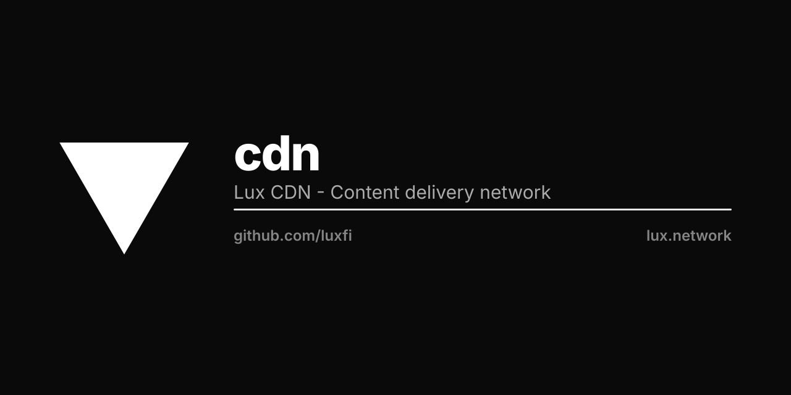

# cdn

The Lux estate's mark library: exchange token icons, bridge currency and network
marks, brand artwork, product media. `public/` is the whole of it — 640 files —
and every one is addressed by its path.

    https://cdn.lux.cloud/exchange/icon-svg/leth.svg
    https://cdn.lux.cloud/exchange/icon-png/lux.png
    https://cdn.lux.cloud/bridge/networks/ethereum_mainnet.png

`cdn.lux.network` serves the same files under the older name. Shipped clients —
the wallets, Safe's chain list, the ad server's VAST — dial it from machines we
cannot edit, so it stays. New references use `cdn.lux.cloud`.

## Adding a file

Commit it under `public/` and merge to `main`. `.github/workflows/site.yml`
publishes the tree to the Sites plane, and hanzoai/ingress serves it at both
hosts within the minute.

A publish reconciles: the manifest is what the host then holds, so a file
deleted here is deleted there. Nothing is versioned by URL — a path is a stable
name whose bytes may be corrected. The edge caches a file for a day.

There is no listing and no upload. A path that names no file answers 404, which
is what lets a caller tell a missing mark from a wrong one.
